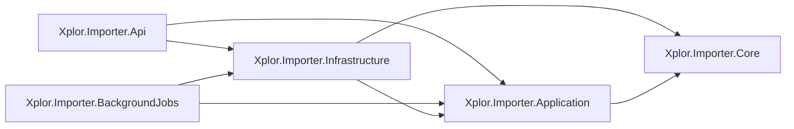
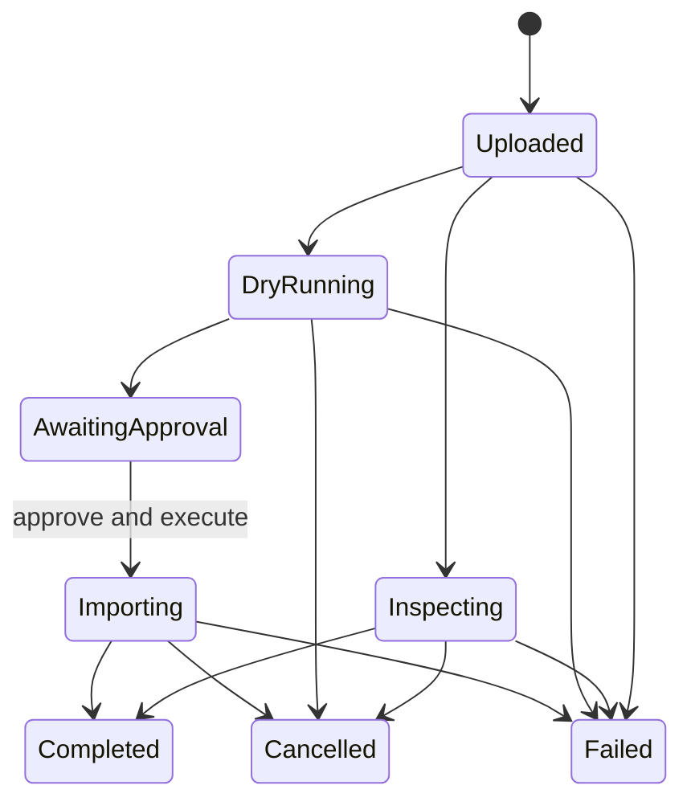

# Xplor Importer System Architecture

## 1. Purpose

Build a secure ASP.NET Core Web API that accepts an Xplor export ZIP, validates and maps its CSV files, and imports approved records into OWNA MongoDB. The application must be deterministic, auditable, safe to rerun, and dry-run-first.

Read this document with `CLAUDE.md`.

## 2. Architecture Principles

1. Never write to the wrong OWNA centre.
2. Never create duplicate records on a rerun.
3. Never silently coerce ambiguous source data.
4. Reconcile every accepted, rejected, skipped, and written row.
5. Use the same parsing, validation, and mapping path for dry-run and import.
6. Keep HTTP, CSV, and MongoDB concerns outside business rules.
7. Default to non-destructive behavior and least privilege.

## 3. Solution Structure

```text
Xplor.Importer.sln
src/
  Xplor.Importer.Core/
  Xplor.Importer.Application/
  Xplor.Importer.Infrastructure/
  Xplor.Importer.Api/
  Xplor.Importer.BackgroundJobs/
tests/
  Xplor.Importer.Core.Tests/
  Xplor.Importer.Application.Tests/
  Xplor.Importer.Infrastructure.Tests/
  Xplor.Importer.Api.Tests/
  Xplor.Importer.BackgroundJobs.Tests/
Directory.Build.props
Directory.Packages.props
```



- `Core` defines entities, value objects, enums, invariants, and import-run state. It has no HTTP, CSV, MongoDB, logging, or configuration dependencies.
- `Application` defines use cases, mapping, validation, phase orchestration, and ports.
- `Infrastructure` implements file storage, ZIP/CSV parsing, MongoDB persistence, run locking, and reports.
- `Api` is a composition root for the HTTP process. It handles HTTP, authentication, authorization, request validation, OpenAPI, run creation, and command enqueueing only; it does not execute migration phases.
- `BackgroundJobs` is a separate deployable worker host. It consumes durable import work items, invokes Application use cases, updates durable run state, and handles retries, cancellation, and graceful shutdown. It is a continuously running worker, not a scheduler or polling-based sync service.
- `Api` and `BackgroundJobs` may share `Application` and `Infrastructure` implementations, but they have separate process lifetimes, health checks, deployment settings, and scaling controls.
- No circular references or Infrastructure types may leak into `Core` or `Application`.

## 4. API Contract

Imports are asynchronous resources. Upload requests must not remain open while an import runs.

| Method | Route                              | Purpose                                                    | Success        |
| ------ | ---------------------------------- | ---------------------------------------------------------- | -------------- |
| `POST` | `/api/import-runs`                 | Upload ZIP, centre mapping, and `Inspect` or `DryRun` mode | `202 Accepted` |
| `GET`  | `/api/import-runs/{runId}`         | Get status, phase progress, counts, and warnings           | `200 OK`       |
| `GET`  | `/api/import-runs/{runId}/report`  | Download the redacted report                               | `200 OK`       |
| `POST` | `/api/import-runs/{runId}/approve` | Approve a successful dry-run                               | `200 OK`       |
| `POST` | `/api/import-runs/{runId}/execute` | Start the approved import                                  | `202 Accepted` |
| `POST` | `/api/import-runs/{runId}/cancel`  | Request cancellation                                       | `202 Accepted` |

API rules:

- Return the generated `runId` and initial status in the response body. Do not return a `Location` header or `statusUrl`.
- Use dedicated sealed request/response records; never expose domain or MongoDB models.
- Serialize API enums as strings.
- Return RFC 9457 `ProblemDetails` for errors.
- Use `400` for malformed requests, `401/403` for access failures, `404` for unknown runs, `409` for invalid state transitions, `413` for oversized uploads, and `422` for import validation failures.
- Document endpoints and schemas with OpenAPI.
- Production import must be a separate approved action, never a flag on the upload request.

## 5. Import Lifecycle



- Persist run state and the work item before returning `202 Accepted`.
- The API enqueues a durable work item containing the `runId` and returns. `BackgroundJobs` claims and processes that item in a separate process.
- Never start fire-and-forget work from an endpoint. The queue and run state must survive API restarts and allow the worker to reclaim abandoned work safely.
- Enforce explicit state transitions and one active write run per destination centre.
- Production import must reference the exact dry-run file hash, centre mapping, mapping version, and approval record.
- Restarted work must resume safely or converge through idempotent phases.

The v1 deployment model is one API application plus one `BackgroundJobs` application. A scheduler is not required: work starts when the API submits a run or when an approved execution command is submitted. The durable queue technology remains a deployment decision, but it must provide at-least-once delivery, leasing/claiming, retry visibility, and safe deduplication by `runId`.

Phase order:

1. centre group and centre;
2. rooms, fees, and discounts;
3. staff;
4. parents and children;
5. relationships and families;
6. bookings and enrolments;
7. attendance;
8. billing, ledger, and bond;
9. approved QKFS/Kindy data.

## 6. Data and Coding Practices

- Use explicit POCOs for every supported CSV table and OWNA collection.
- Keep API DTOs, CSV row POCOs, validated domain records, destination contracts, and MongoDB persistence POCOs separate.
- Do not use `dynamic`, `DataRow`, positional arrays, `Dictionary<string, object>`, or ad hoc `BsonDocument` access in mapping code.
- Allow raw BSON only in an isolated Infrastructure adapter for a proven polymorphic shape.
- Map CSV headers and legacy lowercase BSON fields explicitly.
- Enable nullable reference types and warnings as errors.
- Prefer immutable sealed records for contracts and value objects for identifiers.
- Use enums only for verified closed sets. Assign explicit persisted values and reject unknown external values.
- Use `RunMode` (`Inspect`, `DryRun`, `Import`), not boolean mode flags.
- Use `DateTimeOffset` for instants, `DateOnly`/`TimeOnly` where appropriate, `decimal` for money, and strings for source IDs unless numeric semantics are guaranteed.
- Use collection-specific ports; do not create `IGenericRepository<T>`.
- Use FluentValidation at API and Application boundaries.
- Pass `CancellationToken` through all asynchronous I/O.
- Classify failures as row rejection, phase failure, run failure, or cancellation. Unexpected exceptions fail the run.

```text
HTTP upload -> durable run + work item -> BackgroundJobs
                                      -> CSV POCO -> validated domain record
                                      -> destination contract -> MongoDB persistence model
```

## 7. File and CSV Security

- Accept one ZIP per run and enforce compressed and uncompressed size limits.
- Stream uploads to durable temporary storage outside the web root; do not buffer the complete file in memory.
- Generate stored filenames and never trust the client filename.
- Record a SHA-256 hash and apply an explicit retention policy.
- Reject path traversal, encrypted archives, nested archives, duplicate tables, unsupported encodings, excessive entry counts, and suspicious compression ratios.
- Configure delimiter, quote, escape, headers, trimming, and missing-field behavior explicitly.
- Treat headers as versioned contracts and reject unapproved schema drift.
- Validate primary keys before foreign keys and foreign keys before mapping.
- Never commit customer exports as test fixtures.

## 8. MongoDB Practices

- Use `IMongoCollection<TDocument>` and explicit BSON mappings in Infrastructure.
- Stamp every imported record with `sourcetype = "Xplor"` and a stable `externalid`.
- Use centre-qualified external IDs for centre-scoped records.
- Match by stable source identity, never mutable names or email addresses.
- Classify fields as insert-only, importer-owned, preserve-existing, or unresolved.
- Use `SetOnInsert` for verified immutable fields.
- Use bounded bulk writes while retaining source-key attribution for errors.
- Design phases to be restartable and convergent; do not depend on multi-collection transactions.
- v1 must not delete, deactivate, or orphan-sweep records.
- An identical rerun must create no new identities.

## 9. Security, Logging, and Audit

- Require authenticated operator access and a dedicated import permission.
- Require stronger authorization for approval, execution, cancellation, and report download.
- Apply request-size, concurrency, and rate limits.
- Use anti-forgery protection for cookie authentication; otherwise require token authentication.
- Store MongoDB credentials and other secrets in the approved secret provider.
- Log run ID, phase, safe source-key hash, counts, duration, and error code with structured `ILogger<T>` messages.
- Never log raw rows, names, birth dates, addresses, emails, phone numbers, CRNs, payment data, credentials, or connection strings.
- Audit upload, validation, approval, execution, cancellation, completion, failure, and report access with actor and timestamp.
- Keep operational logs separate from redacted migration reports.

## 10. Testing

- **Core:** value-object invariants, enum conversion, source-key stability, and run-state transitions.
- **Application:** deterministic mappings, unknown values, missing references, phase order, reconciliation, cancellation, and dry-run write exclusion.
- **Infrastructure:** ZIP defenses, CSV edge cases, exact BSON mappings, first import, identical rerun, partial failure, and `SetOnInsert` preservation against isolated MongoDB.
- **API:** authentication, authorization, multipart limits, status codes, `ProblemDetails`, state conflicts, approval requirements, and report access.

Use synthetic or irreversibly anonymized fixtures only.

## 11. Required Decisions Before Mapping Implementation

- v1 source-table scope;
- centre-mapping format;
- `externalid` formula per entity;
- staff identity across centres;
- guardian email conflicts;
- field ownership and `SetOnInsert` behavior;
- PrimaryCarerChangeHistory handling;
- BookingPatternProposal/BookingPatternCreation retention (these two tables are ~305 MB and ~239 MB in an observed export and represent a booking-pattern approval/versioning history OWNA has no matching collection for; decide whether full history is required or only current state, before implementation);
- QKFS/Kindy mapping;
- durable queue technology, worker deployment/scaling, and file-retention policy;
- authentication, roles, and approval evidence;
- post-write verification and repair procedure.

Do not implement an affected production mapper until its decision is approved.
