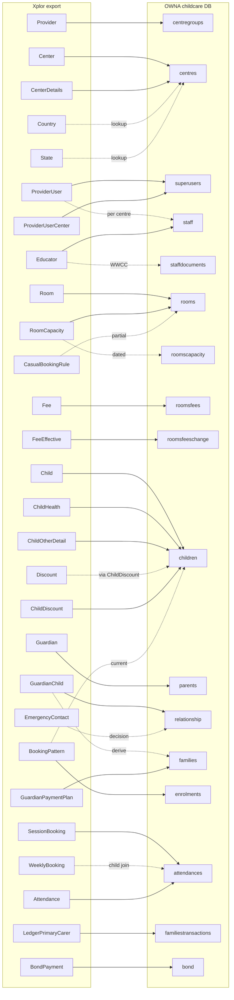
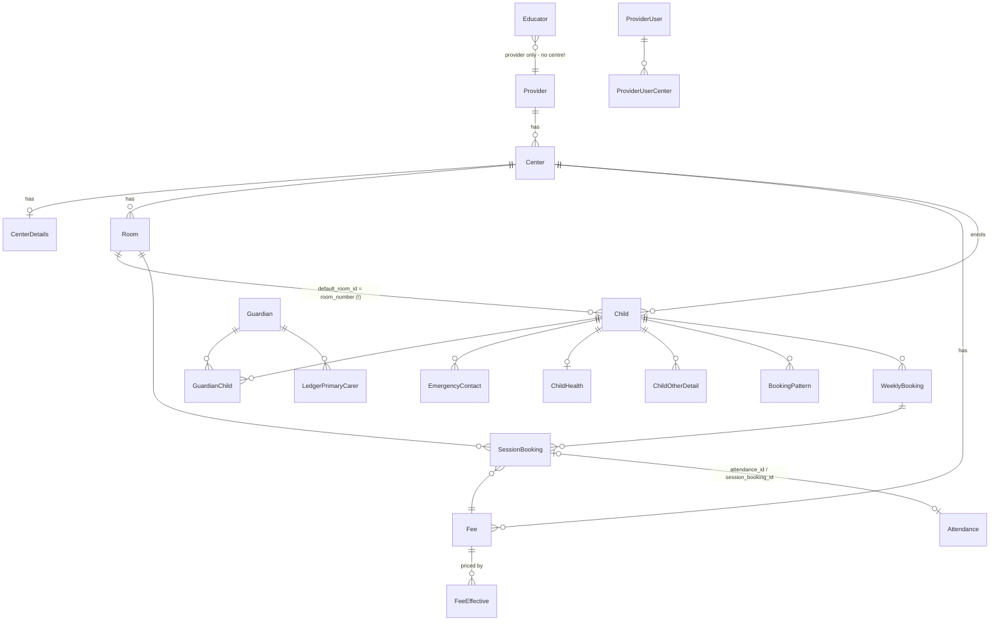
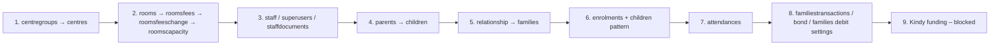

# Xplor → OWNA Field Mapping Report

> **Status:** Draft analysis — **not an approved mapping artifact**. Every row marked ⚠ is an open decision that must be approved before its mapper is implemented (see `CLAUDE.md` → *Non-negotiable open decisions* and `docs/SYSTEM_ARCHITECTURE.md` §11).
>
> **Export analysed:** `xplor_report_db_2026-05-19-13_39_17_full` (49 CSV tables, ~5.3 GB, one Provider, 18 Centers). Large tables were profiled from the first ~40 MB (ledger also at 25/50/75/97% offsets); "est." row counts are extrapolated from bytes-per-row. Small tables were profiled in full. No customer values are reproduced in this document beyond non-identifying codes and enum values.
>
> **OWNA evidence:** code in `OwnaHQ`, `OwnaWCF`, `Portal`, `OwnaConsole`, `OWNAxInfoCareIntergration`, plus a read-only shape sample of the `childcare` database on OWNADEV (400-document `$sample` per collection).

## Contents

- [1. How to read this report](#1-how-to-read-this-report)
- [2. Export inventory and verdict](#2-export-inventory-and-verdict)
- [3. Diagrams](#3-diagrams)
- [4. Cross-cutting rules](#4-cross-cutting-rules)
- [5. Organisation and centre](#5-organisation-and-centre)
- [6. Rooms, fees and capacity](#6-rooms-fees-and-capacity)
- [7. Staff and provider users](#7-staff-and-provider-users)
- [8. Children, guardians and families](#8-children-guardians-and-families)
- [9. Booking patterns](#9-booking-patterns)
- [10. Bookings and attendance](#10-bookings-and-attendance)
- [11. Billing, discounts and bond](#11-billing-discounts-and-bond)
- [12. QKFS (Queensland Kindy Funding) — empty in this export, mapping blocked](#12-qkfs-queensland-kindy-funding-empty-in-this-export-mapping-blocked)
- [13. Reference / lookup tables](#13-reference-lookup-tables)
- [14. Tables that are not imported (explicit)](#14-tables-that-are-not-imported-explicit)
- [15. OWNA runtime behaviours that affect the import](#15-owna-runtime-behaviours-that-affect-the-import)
- [16. Open decisions register](#16-open-decisions-register)
- [17. Evidence index (primary references)](#17-evidence-index-primary-references)

---

## 1. How to read this report

| Symbol | Meaning |
|---|---|
| ✅ | Direct copy (possibly trimmed / type-converted). |
| 🔁 | Deterministic transform or lookup (rule stated in the row). |
| ⚠ | Mapping is plausible but **needs an approved decision** or source confirmation. |
| ❌ | Not mapped — no OWNA home, not needed, or must not be imported (reason stated). |
| 🔒 | Sensitive field — redact in logs/reports; import only if explicitly approved. |

Conventions used in the tables:

- OWNA field names are the literal lowercase BSON names. Link fields (`centreid`, `roomid`, `childid`, `parentid`, `feesmatrix*`, `accountid`…) are **strings holding an ObjectId hex**, not `ObjectId`s — this is how Portal reads them.
- `str-date` = string `yyyy-MM-dd`; `DT` = BSON DateTime (UTC).
- "Resolve X" means: look up the OWNA `_id` previously written for Xplor row X via `(sourcetype = "Xplor", externalid)`; if not found, **reject the row with a reason** (never fall back to a name match).

---

## 2. Export inventory and verdict

| # | Xplor CSV | Rows (observed) | OWNA target | Verdict |
|---|---|---:|---|---|
| 1 | Provider | 1 | `centregroups` | ✅ Mapped |
| 2 | Center | 18 | `centres` | ✅ Mapped (only mapped/approved centres) |
| 3 | CenterDetails | 14 | `centres` (merge) | ✅ Mapped |
| 4 | CenterUser | 18 | — | ❌ No centre-login concept in OWNA |
| 5 | ProviderUser | 109 | `superusers` + `staff` | ⚠ Partial (identity decision) |
| 6 | ProviderUserCenter | 534 | `superusers.credentials[]` | ⚠ Partial |
| 7 | SuperAdmin | 6 | — | ❌ Xplor vendor/API accounts |
| 8 | Xplorer | 2,338 | — | ❌ Xplor consumer-app identities |
| 9 | Educator | 669 | `staff` (+ `staffdocuments`) | ⚠ Mapped, **no centre link in source** |
| 10 | Room | 96 | `rooms` | ✅ Mapped |
| 11 | RoomCapacity | 127 | `rooms.capacity` / `roomscapacity` | 🔁 Mapped (current value) |
| 12 | RoomCustomCapacity | 0 | `roomscapacity` | Empty in this export |
| 13 | Fee | 184 | `roomsfees` | 🔁 Mapped (fan-out per room) |
| 14 | FeeEffective | 420 | `roomsfeeschange` | 🔁 Mapped |
| 15 | CasualBookingRule | 51 | `rooms.casualbooking*` | ⚠ Partial |
| 16 | Discount | 60 | `children.feediscountedpercentage` (via ChildDiscount) | ⚠ Partial |
| 17 | DiscountEffective | 0 | — | Empty in this export |
| 18 | ChildDiscount | 1,292 | `children.feediscountedpercentage`, `staffchild` | ⚠ Partial |
| 19 | Child | 3,971 | `children` | ✅ Mapped |
| 20 | ChildHealth | 3,332 | `children` (health fields) | ✅ Mapped (🔒) |
| 21 | ChildOtherDetail | 3,993 | `children` / `relationship` consents | ⚠ Partial |
| 22 | Guardian | 5,881 | `parents` | ✅ Mapped |
| 23 | GuardianChild | 7,865 | `relationship` | ✅ Mapped |
| 24 | EmergencyContact | 4,751 | `relationship` (+ non-login `parents`) or `children.emergency1/2` | ⚠ Decision |
| 25 | PrimaryCarerChangeHistory | 275 | — | ❌ No history store (open decision) |
| 26 | (derived) Family | — | `families` | 🔁 Derived from GuardianChild |
| 27 | BookingPattern | 6,305 | `enrolments` + `children` pattern | 🔁 Mapped |
| 28 | BookingPatternProposal | ~3.0 M est. (320 MB) | — | ❌/⚠ Retention decision |
| 29 | BookingPatternCreation | ~2.7 M est. (251 MB) | — | ❌/⚠ Retention decision |
| 30 | WeeklyBooking | ~0.8 M est. (68 MB) | — (join table only) | 🔁 Used for child resolution only |
| 31 | SessionBooking | ~3.9 M est. (531 MB) | `attendances` | 🔁 Mapped |
| 32 | Attendance | ~1.0 M est. (130 MB) | `attendances` (merge into SessionBooking doc) | 🔁 Mapped |
| 33 | ParentBookingRequest | 33,206 | `casualbookings` / `enrolments` (partial) | ⚠ Mostly not imported |
| 34 | EducatorBookingRequest | 4,827 | — | ❌ No OWNA equivalent |
| 35 | LedgerPrimaryCarer | ~5.5 M est. (2.2 GB) | `familiestransactions` | ⚠ Opening balance vs full ledger |
| 36 | GuardianPaymentPlan | 3,145 | `families` (debit settings) | 🔁 Partial |
| 37 | GuardianScheduledPayment | 122,061 | — | ❌ Gateway history; not re-playable |
| 38 | BondPayment | 0 | `bond` | Empty in this export (mapping defined) |
| 39–45 | Qkfs* (7 tables) | 0 | Kindy funding | Empty in this export — see §12 |
| 46 | Country | 251 | `countries` (lookup only) | 🔁 Lookup, not imported |
| 47 | State | 4,254 | — | ❌ No `states` collection; used as lookup only |
| 48 | Currency | 4 | — | ❌ OWNA has no currency model |
| 49 | AuditLog | ~3.0 M est. (1.8 GB) | — | ❌ Not imported (v1 scope) |

---

## 3. Diagrams

### 3.1 Table-to-collection map

Not shown (not mapped): CenterUser, SuperAdmin, Xplorer, AuditLog, Currency, PrimaryCarerChangeHistory, BookingPatternProposal, BookingPatternCreation, EducatorBookingRequest, GuardianScheduledPayment, DiscountEffective, RoomCustomCapacity, Qkfs*.

### 3.2 Xplor source relationships that drive resolution

### 3.3 Import phase order (matches SYSTEM_ARCHITECTURE §5)

---

## 4. Cross-cutting rules

### 4.1 Source identity (`sourcetype`, `externalid`)

Follow the `OWNAxInfoCareIntergration` convention (`MigrationConstants.BuildExternalId`, delimiter `::`), with `sourcetype = "Xplor"`.

| OWNA collection | `externalid` formula (proposed) | Notes |
|---|---|---|
| `centregroups` | `{Provider.id}` | Raw source id, as InfoCare does. |
| `centres` | `{Center.id}` | Raw source id. |
| `rooms` | `{Room.id}::{Center.id}` | Room ids are globally unique, centre-qualified for safety. |
| `roomsfees` | `{Fee.id}::{Room.id}::{Center.id}` | One Xplor Fee fans out to one OWNA fee **per room** (see §6.3). |
| `roomsfeeschange` | `{FeeEffective.id}::{Room.id}::{Center.id}` | Same fan-out. |
| `staff` | `{Educator.id}::{Center.id}` / `pu-{ProviderUser.id}::{Center.id}` | Prefix avoids Educator/ProviderUser id collisions. ⚠ centre decision. |
| `superusers` | `pu-{ProviderUser.id}` | |
| `parents` | `{Guardian.id}::{Center.id}` | OWNA `parents` are per centre; a guardian linked to children in N centres becomes N parent docs (468 guardians span >1 centre). |
| `children` | `{Child.id}::{Center.id}` | |
| `relationship` | `{GuardianChild.id}::{Center.id}` (EC: `ec-{EmergencyContact.id}::{Center.id}`) | InfoCare uses `{ownaChild}::{ownaParent}::{ownaCentre}`; source-id form is more stable across reruns. |
| `families` | `fam-{primary-carer Guardian.id}::{Center.id}` | Derived; Xplor's ledger is keyed by primary carer, so one family per primary carer per centre (see §8.7). ⚠ |
| `enrolments` | `{BookingPattern.id}::{Center.id}` | |
| `attendances` | `{SessionBooking.id}::{Center.id}`; unbooked: `att-{Attendance.id}::{Center.id}` | |
| `familiestransactions` | `{LedgerPrimaryCarer.id}::{Center.id}` | |
| `bond` | `{BondPayment.id}::{Center.id}` | |

Upsert on `(sourcetype, externalid)`. Use `SetOnInsert` for `_id`, `dateadded`, `password`, `pin`, `salt`, `sourcetype`, `externalid`; `Set` for importer-owned fields.

### 4.2 Value normalisation

| Xplor pattern | Rule |
|---|---|
| `0000-00-00`, `0000-00-00 00:00:00`, empty | `null` → omit field. |
| `0` / `-1` in a *text* column (e.g. `gender=0`, `religion=0`, `indigenous_status=0`, `state_id=0`) | Treat as "not provided" → omit. |
| Datetimes (`YYYY-MM-DD HH:mm:ss`) | Profiled values are **UTC** (e.g. check-in `00:31:27` for a Melbourne centre ≈ 10:31 local). ⚠ confirm with Xplor; store as UTC `DT`. |
| Date-only (`YYYY-MM-DD`) | `str-date` for OWNA fields that are strings (`attendancedate`), `DT` at 00:00 centre-local→UTC for DT fields (`dob`, `enrolmentstart`) — mirror what Portal writes. |
| `state_id` | Join `State.csv` → `abbreviation` (`194 → VIC`, `189 → NSW`, …). Some Guardian/Educator rows hold free text (`Victoria`, `VIC`) → normalise via the AU state table; anything else → warning, omit. |
| `country_id` | Join `Country.csv` → `name` (`13 → Australia`). |
| Flags `0/1` | `bool`; OWNA commonly stores `true` only and omits `false` (e.g. `rooms.disabled`, `casualbooking`) — follow per-field convention. |
| Demo rows (`first_name = "demo child/parent/educator"`) | Skip with reason `DemoRecord`. |
| `is_deleted = 1` / `deleted_at` / `date_deleted` set | Skip with reason `SourceDeleted` (non-destructive default). |

### 4.3 Centre scoping

Every centre-scoped row must resolve its `center_id` through the approved **centre mapping file** (Xplor `Center.id` → OWNA `centres._id` or "create"). Rows whose centre is unmapped are rejected with `CentreNotMapped`. Note that several tables carry no `center_id` of their own and must inherit it: `Guardian` (via GuardianChild), `Educator` (**no path — see §7.1**), `Attendance` (via SessionBooking → WeeklyBooking), `BookingPattern` (via Child).

---

## 5. Organisation and centre

### 5.1 Provider.csv → `centregroups`

| Xplor field | OWNA field | Rule |
|---|---|---|
| id | `externalid` | ✅ raw id; `sourcetype="Xplor"`. |
| name | `name` | ✅ |
| — | `description` | 🔁 `"{name} - Xplor ({id})"` (InfoCare convention, `CentreGroupMigrationService.cs:56-87`). |
| address_line1 (+ address_line2) | `address` | 🔁 join with `", "`; omit when blank. |
| suburb | `suburb` | ✅ |
| state_id | `state` | 🔁 State lookup → abbreviation. |
| postcode | `postcode` | ✅ string. |
| contact_email_address | `email` | ✅ lower-case. |
| contact_phone_number | `phone` | ✅ |
| contact_first_name / contact_last_name | `accountname` | ⚠ only if the group's billing contact should be this person. |
| country_id | — | ❌ `centregroups` has no country field. |
| currency_id | — | ❌ OWNA has no currency model (value is `0` anyway). |
| abn | — (`centres.abn`) | 🔁 OWNA stores ABN on **centres**, not groups; copy to each centre only if `Center` has none (empty in this export). |
| status | — | ❌ groups have no status. |
| date_created | `dateadded` | ✅ `SetOnInsert`. |
| date_last_modified, exportdb_last_run_at | — | ❌ source housekeeping. |

If the operator maps the Provider to an **existing** OWNA group, do not overwrite `name/description`; only stamp nothing (the group is not Xplor-owned). ⚠

### 5.2 Center.csv + CenterDetails.csv → `centres`

Only centres present in the approved centre mapping are imported. Four source centres have `status = 0` (inactive/legacy duplicates, e.g. the two "Diamond Creek" rows) — recommend excluding them unless mapped.

| Xplor field | OWNA field | Rule |
|---|---|---|
| Center.id | `externalid` | ✅ |
| Center.provider_id | `groupid`, `group` | 🔁 resolve centregroup → `_id` hex and name. |
| name | `name` | ✅ |
| username | `alias` | ⚠ OWNA alias = login URL slug (lowercase alphanumeric, must be unique). Generate from name; do not trust source uniqueness. |
| account_manager | — | ❌ Xplor CRM field. |
| type (`LDC`, `Hybrid`) | `servicetype` | 🔁 `LDC→LDC`; `Hybrid` ⚠ has no OWNA value (`LDC, LDCBASC, OSHC, Preschool, FDC, IHC, Partnerships`) — operator must choose. |
| submission_type (`fees`/`room`) | — | ❌ Xplor CCS submission mode. |
| capacity | `approvedplaces` | ✅ int; `0` → omit. |
| timezone_name (IANA `Australia/Melbourne`) | `timezone` | 🔁 IANA→Windows id (`AUS Eastern Standard Time`) via `TimeZoneMapper` as InfoCare does. |
| ccs_enabled | `ccss` | 🔁 set `true` only when 1; otherwise omit. |
| address_line1 (+2) | `address` | 🔁 join with `", "`. |
| suburb | `suburb` | ✅ |
| postcode | `postcode` | ✅ string. |
| state_id | `state` | 🔁 lookup → `VIC` etc. |
| country_id | `country` | 🔁 lookup → full name (`Australia`). |
| address_latitude / address_longitude | `lat`, `lng` | 🔁 double; `0.0` → omit (Portal geocodes later). |
| contact_first_name / contact_last_name | `approvedprovider.contact` | ⚠ only if this is the approved-provider contact. |
| contact_email | `email` | ✅ lower-case. |
| contact_phone | `phone` | ✅ |
| status (1/0) | `closed` | 🔁 `0 → closed:true` only for an explicitly mapped inactive centre. |
| date_created | `dateadded` | ✅ `SetOnInsert`. |
| date_last_modified | `lastupdated` | 🔁 import time, not source time. |
| CenterDetails.acecqa_id (`SE-…`) | `serviceapprovalnumber` | ✅ (ACECQA service approval number). |
| CenterDetails.proda_id | `providerapprovalnumber` | ⚠ PRODA org id ≠ provider approval number (`PR-…`). Confirm before mapping; otherwise ❌. |
| CenterDetails.legacy_id, group | — | ❌ empty in export. |
| CenterDetails.weeks_in_past_can_edit_bookings | — | ❌ no OWNA equivalent (empty anyway). |
| CenterDetails.is_enrolment_auto_invite_family | — | ❌ Xplor workflow flag. |

Fields OWNA needs that Xplor does not provide (set on insert only, per Console `centre-add.aspx.cs` defaults): `feesmatrix:true`, `transactionalinvoice:true`, `openingtime`/`closingtime` (derive min/max of Room start/finish), `sessiontimes[]` (distinct `HH:mm-HH:mm` from Fee start/finish — required for `roomsfees.sessionofcare` dropdowns), `package`, feature flags. ⚠ creating brand-new centres through the importer vs. pre-creating them in Console is a centre-mapping decision; **recommended: pre-create in Console and map**, importer only fills the fields above that are empty.

### 5.3 CenterUser.csv → ❌ not mapped

A CenterUser is Xplor's *shared login for a centre* (`username`, `email`, `phone`, address). OWNA has **no centre-level credential** — staff log in individually against `staff` (`Portal/portal/auth/login/default.aspx.cs:226-242`) and `centres` holds no credentials. Its contact data duplicates `Center.contact_*`. Do not import; if the centre needs a generic admin account, create it manually in OWNA.

---

## 6. Rooms, fees and capacity

### 6.1 Room.csv → `rooms`

(Aligns with the reviewer's annotated screenshot: green = mapped, red = no direct field.)

| Xplor field | OWNA field | Rule |
|---|---|---|
| id | `externalid` | ✅ `{id}::{center_id}`. `_id` is new (`SetOnInsert`). |
| center_id | `centreid`, `centre` | 🔁 resolve centre → `_id` hex + centre name. |
| name | `roomname` | 🔁 replace `/`→`-`, `&`→`and` (Portal rule); must be unique within the centre (duplicates exist in export, e.g. two "Kinder" rooms at different centres — fine; same-centre duplicate → reject). |
| room_number | `order` | 🔁 display order (1..n). Also the **join key for `Child.default_room_id`** (see §8.1). |
| type (1–5) | `roomtype` | ⚠ Xplor code is an undocumented age band (1≈nursery … 4/5≈kinder, also used for "Kitchen"/"Community"). OWNA `roomtype ∈ {LDC, PRESCHOOL, BSC, ASC, VAC}`. No safe mapping → omit unless Xplor confirms the enum (then 4/5→`PRESCHOOL`?, 1–3→`LDC`). |
| start_time / finish_time | — | ❌ OWNA rooms have no opening hours. Use min/max across rooms to seed `centres.openingtime/closingtime` only when those are empty. |
| age_from / age_to (`"1 Year 3 Month"`) | `agemin` / `agemax` | 🔁 parse to **months as a string** (`"15"`). OWNA UI only offers `0,3,6,12,18,24,30,36,42,48,60,72`; store the exact month value and warn if not in that list (it still works in `casualbookingagerange` logic). Blank → omit. |
| staff_ratio (4, 11, 0) | `ratio` | ✅ int (children per educator, 1:N); `0` → omit. |
| status (1 active / 2 inactive) | `disabled` | 🔁 `2 → disabled:true`; `1` → omit. ⚠ confirm `2` semantics. |
| image (`photos/room_icon/...`) | `picture` | ⚠ relative Xplor storage path, not a URL. Either download and re-host to OWNA GCS, or set `""`. Recommend `""` for v1. |
| date_created | `dateadded` | ✅ `SetOnInsert`. |
| date_last_modified | `lastupdated` | 🔁 import time. |
| (from RoomCapacity) | `capacity` | 🔁 see §6.2. Required ≥ 0. |
| — | `rate` | 🔁 `0.0` (legacy field; fees matrix is on). |

Not populated from Xplor: `roomleaders[]` (no source), `fees[]`/`feechange[]` (legacy, superseded by `roomsfees`), `excluderatio`, `staffonly` (⚠ could set `staffonly:true` for "Kitchen"/"Ed. Leader" rooms — operator decision).

### 6.2 RoomCapacity.csv → `rooms.capacity` (+ optional `roomscapacity`)

Xplor RoomCapacity is an **effective-dated permanent capacity** (`capacity`, `effective_date`), whereas OWNA `roomscapacity` is a **per-day override** (`attendancedate` str-date, `capacity`, `reason`, `staff*`).

| Xplor field | OWNA field | Rule |
|---|---|---|
| room_id | `rooms.capacity` (target doc) | 🔁 take the row with the latest `effective_date ≤ export date` and `is_deleted=0`. |
| capacity | `rooms.capacity` | ✅ int. |
| effective_date (historical rows) | — | ❌ superseded history; not replayed into `roomscapacity` (would create one doc per weekday per range). |
| future-dated rows (`effective_date > export date`) | `roomscapacity` | ⚠ optional: expand to one doc per weekday until the next change, `reason = "Xplor scheduled capacity"`. |
| is_deleted | — | skip deleted. |

**RoomCustomCapacity.csv** — same header, **0 rows** in this export. If populated in other exports it is the true per-day override → `roomscapacity` (`attendancedate` = `effective_date`, `capacity`, `reason = "Xplor custom capacity"`, `staff = "Xplor Import"`).

### 6.3 Fee.csv → `roomsfees`

OWNA fees are **per room**, Xplor fees are **per centre**. The room set for each Xplor fee is derived from usage: distinct `room_id` in `SessionBooking` + `BookingPattern` + `CasualBookingRule` for that `fee_id`. ⚠ Fees never used by any booking: create for all active rooms of the centre, or skip — operator decision (recommend skip + report).

| Xplor field | OWNA field | Rule |
|---|---|---|
| id | `externalid` | 🔁 `{Fee.id}::{Room.id}::{Center.id}` (one doc per room). |
| center_id | `centreid`, `centre` | 🔁 resolve. |
| (derived room) | `roomid`, `roomname` | 🔁 see above. |
| name | `feename` | ✅ unique within (centre, room) — suffix ` (2)` on collision with a warning. |
| amount_gross | `fee` | 🔁 **current** price = FeeEffective row covering the export date, else `amount_gross`. OWNA `fee` is the full (pre-subsidy) session price. |
| amount_net | — | ❌ equal to gross in all observed rows; OWNA has no net field. |
| type = `Casual` | `feecasual` | 🔁 set `feecasual = fee` for Casual fees; `Normal`/`Default` → regular fee only. ⚠ `Default` has no OWNA meaning beyond "centre default"; ignored. |
| start_time / finish_time | `sessionofcare` | 🔁 `"HH:mm-HH:mm"` (e.g. `07:00-17:00`). Must also exist in `centres.sessiontimes[]` — add if missing. Missing times (3 rows) → reject. |
| frequency (`Daily` only) | — | ✅ implicit — OWNA fees are per session/day. Any other value → reject (`UnsupportedFeeFrequency`). |
| visibility (`PUBLIC`/`ADMIN`) | — | ⚠ no OWNA visibility flag. `ADMIN` fees (e.g. "Specific Absence", "P/U and D/O Fee") are admin-only charges; importing them as bookable fees exposes them to parents. Recommend: import `ADMIN` fees with `archived:true` if referenced by history, else skip. |
| is_deleted = 1 | `archived: true` | 🔁 only if referenced by imported history; else skip. |
| date_created | `dateadded` | ✅ |
| date_last_modified | `lastupdated[]` | 🔁 `[{staffid:"", staff:"Xplor Import", dateadded: now}]` (array shape). |
| — | `status` | 🔁 `"active"`. |
| — | `staff`, `staffid` | 🔁 `"Xplor Import"`, `""`. |

### 6.4 FeeEffective.csv → `roomsfeeschange`

OWNA resolves a price at attendance time as *roomsfees price overridden by the latest non-archived `roomsfeeschange` with `scheduledate ≤ date`* (`CustomFunction.cs:3259-3280`). Import every non-deleted FeeEffective row per derived room.

| Xplor field | OWNA field | Rule |
|---|---|---|
| id | `externalid` | 🔁 `{id}::{Room.id}::{Center.id}`. |
| fee_id | `feesmatrixid` | 🔁 resolve the per-room `roomsfees._id`. Also copy `feename`, `sessionofcare`, `room` (**room name — field is `room`, not `roomname`**), `roomid`, `centreid`, `centre`. |
| gross_amount | `fee` (and `feecasual` if parent fee is Casual) | ✅ double. |
| net_amount | — | ❌ |
| effective_start_date | `scheduledate` | 🔁 DT at centre-local midnight. |
| effective_finish_date (`2050-01-01` = open) | — | ❌ implicit (next change supersedes). |
| is_deleted = 1 | skip | 96 deleted rows. |
| — | `processed` | 🔁 `true` when `scheduledate ≤ now`. |
| date_created | `dateadded` | ✅ |

### 6.5 CasualBookingRule.csv → `rooms.casualbooking*` (partial)

| Xplor field | OWNA field | Rule |
|---|---|---|
| room_id | target `rooms` doc | 🔁 only `is_active=1 AND is_deleted=0` (21 of 51 rows). |
| fee_id | `casualbookingfeesmatrixid`, `casualbookingfee` | 🔁 resolve room fee; fee = `feecasual ?? fee`. |
| time_start / time_finish | `casualbookingsession` | 🔁 `"HH:mm-HH:mm"`. |
| age_start_year/month, age_finish_year/month | `casualbookingagerange:true` (+ room `agemin/agemax`) | ⚠ OWNA only filters by the *room's* age range. Set the flag only when the rule's range equals the room's range; otherwise warn. |
| days_of_week (`1,2,3,4,5`) | — | ❌ no per-day field; OWNA auto-publishes weekdays only, which matches every observed row. Other values → warning. |
| center_id | — | used for validation. |
| — | `casualbookings` (int spots/day) | ⚠ no Xplor source — must be supplied by operator; leaving it 0/absent disables auto-publish. |

Multiple rules for one room (up to 6 observed) cannot be represented — keep the rule whose fee is the room's default and report the rest.

---

## 7. Staff and provider users

### 7.1 Educator.csv → `staff` (+ `staffdocuments`)

> **Blocking gap:** Educator has **`provider_id` only — no `center_id`**, and the export has no educator↔centre join table. OWNA `staff` is one document **per centre**. Candidate derivations (all ⚠, must be approved — *staff matching across multiple centres* is a non-negotiable open decision):
> 1. centres where the educator appears in `Attendance.educator_id / checked_in_by_id` or `EducatorBookingRequest.educator_id` (→ child's centre) — 140 educators resolvable via EducatorBookingRequest, 13 of them in >1 centre;
> 2. `ProviderUserCenter` when the educator's email equals a ProviderUser email (56 matches);
> 3. an operator-supplied educator→centre list.
>
> Educators with no derivable centre are rejected with `StaffCentreUnresolved`.

| Xplor field | OWNA field | Rule |
|---|---|---|
| id | `externalid` | 🔁 `{id}::{center_id}` per resolved centre. |
| provider_id | — | validation only. |
| first_name | `firstname` | ✅ trimmed. |
| middle_name | — | ❌ no staff middle-name field. |
| last_name | `surname` | ✅ |
| — | `fullname` | 🔁 `firstname + " " + surname` (InfoCare convention). |
| email | `emailaddress` | ✅ lower-case contact email. |
| — | `email` (login username) | 🔁 **generated**, globally unique across `staff` + `parents` (InfoCare: `{name}-{4 digits of SHA256(id+centre)}`), `SetOnInsert`. 111 educator emails also belong to Guardians and 4 are duplicated among educators — never use raw email as username. |
| phone_primary | `contactno` | ✅ |
| phone_secondary | — | ❌ no second phone field. |
| gender, pronouns | — | ❌ OWNA staff has no gender/pronoun field. |
| date_of_birth | `dob` (string), `dobday`, `dobmonth` | 🔁 staff `dob` is a **string** (unlike children); `0000-00-00` → omit. 🔒 |
| address_line1 (+2) | `address` | 🔁 join. |
| suburb / postcode | `suburb` / `postcode` | ✅ |
| state_id | `state` | 🔁 lookup; free-text `VIC` accepted. |
| address_notes | — | ❌ |
| role | `registeredpositions[]`, `title` | 🔁 `title` = role text; `registeredpositions` via the table below. |
| emergency_name | `emergencycontact` | ✅ |
| emergency_number | `emergencycontactno` | ✅ |
| emergency_alternate_phone, emergency_relationship | — | ❌ (could be appended to `emergencycontact` as text ⚠). |
| hourly_rate | `hourlyrate` | ⚠ payroll data; import only if approved (`0.00` → omit). |
| tax_file_number | — | ❌ 🔒 Empty in export. OWNA stores TFN only AES-encrypted (`staff-edit.aspx.cs:1139`); the importer must never write it. |
| working_with_children_id | `staffdocuments` row | 🔁 🔒 `{staffid, centreid, doctype:"Training", training:{name:"Working With Children Check", notes:<WWCC no.>}, status:"Pending"}` (`worker-register.aspx.cs:410-415`). No expiry/state in source → leave blank. |
| status (0 / 1 / 3) | `inactive` | ⚠ observed 1=187, 3=439, 0=43. Proposed: `1` active, `0`/`3` → `inactive:true`. Needs Xplor confirmation. |
| date_created | `dateadded` | ✅ `SetOnInsert`. |
| — | `stafftype` | 🔁 `"staff"` default; `"admin"` for Director / Service Leader / Children's Services Manager ⚠. |
| — | `password`, `pin` | 🔁 generated, `SetOnInsert`; staff must reset via invite. |

Proposed `role → registeredpositions` (⚠ requires approval — never inferred at runtime):

| Xplor role | OWNA code |
|---|---|
| Educator, Children's Services Employee | `ED` |
| Lead Educator, Service Leader | `RL` (Room Leader) ⚠ |
| Early Childhood Teacher, Kindergarten Teacher | `ECT` |
| Educational Leader | `EL` |
| Director | `DI` |
| Assistant Director | `AD` |
| Children's Services Manager | `OPS` ⚠ |
| Coordinator | `CO` |
| Administration Support Officer | `ADM` |
| Support Worker (Cook) | `CHEF` |
| Support Worker (Kitchen Hand) | `FSS` ⚠ |
| Support Worker (other), blank | none (warning) |

### 7.2 ProviderUser.csv + ProviderUserCenter.csv → `superusers` (+ per-centre `staff`)

ProviderUsers are provider-level admin logins with access to a list of centres. OWNA's equivalent is a **`superusers`** document (`OwnaHQ SuperUserEntity.cs`) whose `credentials[] = {centreid, centre, staffid}` points at a `staff` document **per centre** (Portal SUA login, `auth/sualogin/default.aspx.cs:52-60`).

| Xplor field | OWNA field | Rule |
|---|---|---|
| id | `superusers.externalid` | 🔁 `pu-{id}`. |
| first_name / last_name | `firstname` / `surname` | ✅ |
| email | `email` | ✅ lower-case (SUA login is by email). ⚠ 56 are also Educator emails — link to the same per-centre `staff` doc instead of creating a second one. |
| username | — | ❌ Xplor login name. |
| type (`other`, `1`) | `permission` | ⚠ `fulladmin`/`admin`/`staff` — no source semantics for `other`; proposed `admin`, operator review. |
| phone, address_*, suburb, postcode, state_id, country_id | — | ❌ empty in export / not on superusers. |
| is_deleted = 1 (67 rows) | — | skip. |
| ProviderUserCenter.center_id | `credentials[]` + `staff` doc | 🔁 one `staff` (`stafftype:"admin"`, `externalid = pu-{id}::{center_id}`) per mapped centre; add `{centreid, centre, staffid}` to `credentials`. Unmapped centres dropped with warning. 54 users have >1 centre. |
| date_created | `dateadded` | ✅ |
| — | `password` | 🔁 not portable; generate + invite. |

---

## 8. Children, guardians and families

### 8.1 Child.csv → `children`

| Xplor field | OWNA field | Rule |
|---|---|---|
| id | `externalid` | 🔁 `{id}::{center_id}`. |
| center_id | `centreid`, `centre` | 🔁 resolve. |
| default_room_id | `roomid`, `roomname` | 🔁 **Join on `Room(center_id, room_number)`, not `Room.id`** — verified: 3,742/3,742 non-zero values resolve as room_number, 0 resolve as Room.id. `0` (229 rows) → fall back to the room of the child's current BookingPattern; still none → reject (`roomid`/`roomname` keys are mandatory, Portal indexes them directly). |
| first_name / middle_name / last_name | `firstname` / `middlename` / `surname` | ✅ trim (source has trailing spaces). `middlename` must exist (`""` when blank). |
| — | `name` | 🔁 `firstname + " " + surname`. |
| date_of_birth | `dob` (DT), `dobday`, `dobmonth`, `dobyear` | 🔁 `0000-00-00` → reject (DOB required). 🔒 |
| gender (`Male`/`Female`/`0`/blank) | `gender` | 🔁 `Male→M`, `Female→F`, else omit + warning. |
| gender_identity (`Non-Binary`) | `gender` | ⚠ `X` (edit page then offers `NON_BINARY`); only when `gender` is blank or conflicts — operator decision. |
| pronouns | — | ❌ no child pronoun field. |
| about | — | ⚠ no verified child field (free text). Candidate: `childrennotes` collection — not verified; recommend archive. |
| crn | `crn` | 🔁 upper-case; validate 9 digits + letter; invalid → omit + warning. 🔒 |
| status (0 / 1 / 3 / 4) | `attending` | 🔁 observed: `3` = ended (every row has past end date) → `attending:false`; `1` → `attending:true`; `0` (demo) → skip; `4` (116 rows) ⚠ unknown (waitlist/pending?) — reject until confirmed. |
| enrolment_start_date | `officialstartdate` (str-date), `activefrom` (DT if future) | 🔁 |
| enrolment_end_date | `finishdate` (DT) | 🔁 only when `attending:false` or date in future. |
| special_needs_status (`Yes`/`No`) | `additionalneeds` | 🔁 `Yes → true`; `No` → omit. |
| special_needs_effective_date, disability_effective_date | — | ❌ no date field. |
| disability_status | `disabilities[]` | ⚠ source is Yes/No only (all `No`); no disability type → omit. |
| special_circumstances (43% filled, free text) | — | ⚠ no verified field; review a sample before deciding (may contain court-order text → `courtorderdetails`). |
| religion | — | ❌ OWNA stores religion only on `enrolmentsubmissions`, not on `children`. |
| indigenous_status | `indigenous`, `aboriginalstatus` | 🔁 `Aboriginal…`/`Torres Strait…` → `indigenous:true` + `aboriginalstatus` = Portal long label; `Not Aboriginal…` → `aboriginalstatus` label only; `Not stated`/`0` → omit. ⚠ label vs code representation is inconsistent in OWNA. |
| language | `languagespoken` | ✅ free text (enrolment form precedent). `mainlanguageathome` expects a `languagesathome` code — ❌ do not guess. |
| cultural_background | `culturalbackground` | ✅ |
| cultural_requirements | `allergiesdescription` (append) | ⚠ OWNA's "mild allergies / dietary / cultural needs" text field; append with prefix `Cultural: ` only if approved. |
| address / suburb / postcode | `address` + `streetaddress` / `suburb` / `postcode` | ✅ |
| state_id / country_id | `state` / `country` | 🔁 lookups. |
| is_preschool | `preschoolprogram` | 🔁 `1 → true`. |
| is_ccs_estimates_allowed | — | ❌ Xplor billing preference. |
| legacy_id | — | ❌ empty. |
| referral | — | ❌ enquiry-source data (belongs to leads/enquiries). |
| date_created | `dateadded` | ✅ `SetOnInsert`. |
| — | `parentids[]`, `parentnames` | 🔁 **must be written by the importer** after relationships (Portal does this via `CustomFunction.UpdateChildParentRelationship`). |
| — | `accountid`, `accountname` | 🔁 from the derived family (§8.7). |
| — | `picture` | 🔁 `""`. |
| — | booking-pattern fields | 🔁 from current BookingPattern (§9.1). |

### 8.2 ChildHealth.csv → `children` (health fields) 🔒

One row per child (3,332). **Key finding:** OWNA keeps doctor/dentist/ambulance/religion only on `enrolmentsubmissions` (`enrolment-forms-edit2.aspx.cs:6700-6960`), not on `children`.

| Xplor field | OWNA field | Rule |
|---|---|---|
| child_id | target child | 🔁 resolve. |
| medicare_number (`3377011135/3`, `3399481837 3`) | `medicareno`, `medicarechildno` | 🔁 split 10-digit card number and trailing IRN (1 digit) on `/`, space or 11th digit; unparseable → `medicareno` raw + warning. |
| medicare_expiry_date (`08/2022`) | `medicareexpiry` | ✅ `MM/yyyy` string. |
| has_medical_allergies / medical_allergies, has_non_medical_allergies / non_medical_allergies | `allergy`, `allergies`, `allergiesdescription` | 🔁 `allergy:true` when has_medical_allergies=1 (key only when true); `allergies:true` + description = joined texts. |
| has_anaphylaxis, has_epipen_or_anipen | `anaphylaxis` | 🔁 true if either = 1. |
| has_asthma | `asthma` | 🔁 true only. |
| has_dietary_restrictions / dietary_restriction_codes | `dietaryrestrictions` (+ append codes to `allergiesdescription`) | 🔁 ⚠ codes are Xplor-internal — append raw only if approved. |
| has_other_medical_conditions / other_medical_conditions | `severemedicalcondition` | ✅ text. |
| has_prescribed_medicines / prescribed_medications | — | ⚠ OWNA `medicationlog` records administrations, not standing prescriptions. Recommend append to `severemedicalcondition` as `Medication: …` if approved, else ❌. |
| has_immunisations, has_health_record | — | ❌ booleans only; do not infer `vaccinationstatus` or `childrenimmunisation` flags. |
| practitioner_name / phone / address / health_center | — | ❌ no field on `children` (only `enrolmentsubmissions.medical*`). Decision: drop, or write a synthetic enrolment submission (not recommended). |
| ambulance_cover | — | ❌ same reason (`enrolmentsubmissions.ambulanecover`). |
| is_deleted, dates | — | skip deleted. |

### 8.3 ChildOtherDetail.csv → `children` consents (mostly ❌)

3,993 rows for 3,794 children (duplicates → take latest `id`). These are **form-level declarations/consents**; OWNA stores most of them only on `enrolmentsubmissions`, while per-person authorities (medical, ambulance, excursions, transport) are on `relationship` (per guardian/contact).

| Xplor field | OWNA field | Rule |
|---|---|---|
| consents_photograph_videos | `nopost` | ⚠ `0` means "not consented" **or** "not answered" (see `∅` counts) — set `nopost:true` only for explicit `0` rows with the other consents answered; approval needed. |
| consents_technology | `footagesocialmedia` | ⚠ semantics differ; not recommended. |
| consents_to_seek_medical_treatment, consents_to_transported_by_ambulance, consents_activities_and_excursions, consents_excursions | — | ❌ child-level; OWNA models these per carer on `relationship` (`medicalmedication`, `ambulance`, `outings`, `offpremises`). Do not copy a child-level consent onto every carer. |
| consents_sunscreen, consents_administer_ventolin, consents_original_medication_packaging, consents_permission_for_educators*, consents_agree_*, declarations_* (10 columns) | — | ❌ no OWNA child field. Recommend archive in run artefacts. |

### 8.4 Guardian.csv → `parents`

| Xplor field | OWNA field | Rule |
|---|---|---|
| id | `externalid` | 🔁 `{id}::{center_id}` for **each centre** in which the guardian has a GuardianChild link (Guardian has no centre; 468 span >1 centre → multiple docs). Guardians with no links (e.g. 3 orphans) → skip. |
| first_name / last_name | `firstname` / `surname` | 🔁 trim; `,` → `;` (Portal rule). |
| email | `emailaddress` | ✅ lower-case contact email. |
| — | `email` (+ `loginusername`) | 🔁 **generated unique login username** (see §7.1); `SetOnInsert`. 22 duplicate guardian emails and 111 shared with educators make raw email unsafe. |
| mobile_phone | `phone`, `mobile` | ✅ |
| home_phone | `phone` (fallback) | 🔁 only when mobile is blank (Enrolment.Cs:1227 precedent); else ❌ (no home-phone field). |
| work_email | — | ❌ no field. |
| gender, pronouns | — | ❌ OWNA parents have no gender field. |
| address_line1 (+2) | `address`, `streetaddress` | 🔁 |
| suburb / postcode | `suburb` / `postcode` | ✅ |
| state_id (ids **and** free text `Victoria`, `VIC`, `-1`) | `state` | 🔁 lookup/normalise. |
| country_id | `country` | 🔁 lookup. |
| crn | `crn` | 🔁 upper-case, validate. 🔒 |
| status (0 → 6 rows) | `inactivate` | 🔁 `0 → inactivate:true` (note field name `inactivate`). |
| date_created | `dateadded` | ✅ |
| provider_id | — | validation. |
| — | `password`, `salt`, `pin` | 🔁 generated `SetOnInsert` (6-digit PIN unique per centre across staff + parents). |
| — | `accountid`, `accountname` | 🔁 from family. |

### 8.5 GuardianChild.csv → `relationship`

| Xplor field | OWNA field | Rule |
|---|---|---|
| id | `externalid` | 🔁 `{id}::{center_id}`. |
| child_id | `childid`, `childname` | 🔁 resolve. |
| guardian_id | `parentid`, `parentname` | 🔁 resolve the parent doc for **this** centre. |
| center_id | `centreid`, `centre` | 🔁 must equal the child's centre (4 mismatches → reject). |
| is_primary_carer | `primarycarer` | 🔁 true only. **36 children have >1 primary carer, 23 have none** → keep the most recently modified as primary, others `secondarycarer:true` ⚠; insert primary first (Portal lists by `_id`). |
| parent_relation | `relationship` | 🔁 normalise to Portal list: `Mother`, `Father`, `Parent (Female)`→`Mother`⚠, `Parent (Male)`→`Father`⚠, `Grandparent`→`Grandparents`, `Aunt`/`Uncle`→`Uncle/Aunty`, `Step Parent`, `Guardian`, `Carer`/`Friend`/`Sister`/`Other`→`Other Relative`/`Other`; blank/`0` → `Guardian` (InfoCare default). |
| status (0 → 195 rows) | — | skip inactive links (non-destructive). |
| — | `permission` | 🔁 `fullaccess` for guardians ⚠ (Xplor has no per-guardian access level). |
| — | `emergencycontact`, consent flags | 🔁 from a matching EmergencyContact row (§8.6). |
| date_created | `dateadded` | ✅ |

### 8.6 EmergencyContact.csv → `parents` (contact) + `relationship`

OWNA has **no contacts/nominees collection**; the enrolment approval flow creates each emergency contact / authorised nominee as a `parents` document plus a `relationship` (`Enrolment.CreateEmergencyContact`, `enrolment-forms-edit2.aspx.cs:5589-5879`). The legacy `children.emergency1/2` slots hold only two contacts (up to 7 active per child in Xplor) — not recommended. ⚠ approve mechanism.

| Xplor field | OWNA field | Rule |
|---|---|---|
| id | `externalid` | 🔁 `ec-{id}::{center_id}`. |
| child_id / center_id | `relationship.childid` / `centreid` | 🔁 resolve. |
| first/middle/last_name, email, phone, address, suburb, postcode, state_id, country_id | `parents.*` as §8.4 | 🔁 **Dedup:** if the contact matches a Guardian of the same child by name (496 rows), do **not** create a parent; set the flags on that guardian's relationship instead. |
| relationship_to_child | `relationship.relationship` | 🔁 normalise as §8.5 (`carer` → `Other`). |
| is_emergency_contact | `emergencycontact` | 🔁 |
| is_collection_nominee | `permission` | 🔁 `1 → signinout`, else `""` (authorised pickup is expressed only via permission). |
| is_medical_nominee | `medicalmedication` | 🔁 |
| is_excursions_nominee | `outings`, `offpremises` | 🔁 ⚠ Xplor has one flag for both. |
| is_transportation | `transportation` | 🔁 |
| is_deleted (278) | — | skip. |

### 8.7 Families (derived) → `families`

Xplor has no family table; its ledger (`LedgerPrimaryCarer`) and payment plans are keyed by the **primary carer guardian**. Recommended derivation: **one OWNA family per (primary-carer guardian, centre)**, `childrenid` = children for whom that guardian is primary carer, `parentsid` = all active guardians of those children.

| OWNA field | Rule |
|---|---|
| `externalid` | `fam-{guardian_id}::{center_id}` |
| `accountname` | 🔁 upper-case `"{SURNAME}, {FIRSTNAME}"` of primary carer (matches Xplor ledger "Transaction" naming); must be unique per centre (suffix on clash). |
| `centreid`, `centre` | 🔁 |
| `parentsid[]` / `parentsname[]`, `childrenid[]` / `childrenname[]` | 🔁 a child can belong to only one family per centre (`families-edit.aspx.cs:612-617`). |
| debit settings | from GuardianPaymentPlan (§11.2). |
| `bankac`, `cc`, `signature` | ❌ 🔒 not in export; families must re-sign a DDR in OWNA. |
| — | back-fill `accountid`/`accountname` on member `parents` and `children`. |

---

## 9. Booking patterns

OWNA has **no per-day booking table**: the permanent pattern lives on `children` (live copy) and `enrolments` (dated versions); a nightly job (`BatchAttendancesForCentre`, `Portal/App_Code/CustomFunction.cs:2950-3153`) expands it into future `attendances`. See §15 for the consequences.

### 9.1 BookingPattern.csv → `enrolments` (+ current pattern on `children`)

| Xplor field | OWNA field | Rule |
|---|---|---|
| id | `enrolments.externalid` | 🔁 `{id}::{center_id}` (centre from child). |
| child_id | `childid`, `child` | 🔁 resolve. |
| room_id | `roomid`, `roomname` | 🔁 resolve. |
| fee_id | `feesmatrix`, `feename`, `fee`, `sessionofcare`, `feediscounted` | 🔁 resolve per-room `roomsfees` doc; price effective at `start_date`. |
| child_name, room_name, fee_name | — | ❌ denormalised copies; resolved from OWNA docs instead. |
| start_date | `enrolmentstart` (DT) | ✅ |
| finish_date | `enrolmentend` (DT) | ✅ |
| pattern (`[{"mon":true,…}]`) | `monday…sunday` (+ `mondayalt…sundayalt`) | 🔁 WEEKLY: one element → base days, `alt` = same. FORTNIGHTLY (34 rows): element 0 → the OWNA cycle that contains `start_date`, element 1 → the other. OWNA cycle = `GetIso8601WeekOfYear` parity vs **Monday 2020-07-06**, cycle 2 reads `*alt` (`CustomFunction.cs:2380-2382`). Unknown JSON shape → reject. |
| frequency (`WEEKLY`/`FORTNIGHTLY`) | — | 🔁 drives the rule above. |
| status `PROCESSED_ADD` | `processed:true`, `status` omitted (= approved) | 🔁 |
| status `PROCESSED_REPLACEMENT_CANCEL` / `PROCESSED_CANCELLATION` | `status:"cancelled"` | ⚠ history value only; or skip (current-state-only decision). |
| cancelled_from | `enrolmentend` | 🔁 for cancelled patterns. |
| cancelled_reason | — | ❌ no field. |
| derived_from_booking_pattern_id | — | ❌ Xplor versioning link. |
| session_booking_ids_to_override | — | ❌ Xplor internal. |
| created_by (name text) | `staff` | ✅ text; `staffid = ""`. |
| is_deleted | — | skip. |
| date_created | `dateadded` | ✅ |

**Current pattern → `children`:** for each child take patterns with `start_date ≤ cutover ≤ finish_date` and status `PROCESSED_ADD`. One pattern → flat fields (`roomid/roomname/monday…/fee/feesmatrix/feename/sessionofcare`). Two → second-session fields (`roomid2`, `monday2…`, `feesmatrix2`, `sessionofcare2`). Three or more, or same-day overlaps → advanced `bookings.{day}{1..3}[alt]` shape (InfoCare `BookingMapping.cs`) ⚠. No current pattern → all day flags `false`.

### 9.2 BookingPatternProposal.csv / BookingPatternCreation.csv → ❌ (retention decision)

Proposal = one row per generated date for a pattern (`booking_date`, times, `fee_amount`, `status PROCESSED/FAILED`, `errors`); Creation = link Proposal → SessionBooking with `is_disconnected` history. Every resulting booking already exists in SessionBooking, which is imported (§10). OWNA has no collection for per-date proposals, failures or disconnect history. **Recommendation: current-state only — do not import** (open decision per `CLAUDE.md`).

### 9.3 CasualBookingRule.csv — see §6.5.

---

## 10. Bookings and attendance

### 10.1 SessionBooking.csv (+ WeeklyBooking.csv) → `attendances`

One OWNA `attendances` document = one child × session × day, holding **both** the booking and the actual sign-in/out.

| Xplor field | OWNA field | Rule |
|---|---|---|
| id | `externalid` | 🔁 `{id}::{center_id}`. |
| weekly_booking_id | → WeeklyBooking.child_id / center_id | 🔁 resolve `childid`, `child`, `firstname`, `surname`, `centreid`, `centre` (100% of sampled SessionBookings join). |
| room_id | `roomid`, `room` | 🔁 note attendances use `room`, not `roomname`. `0` (5 rows) → reject. |
| fee_id | `feesmatrixid`, `sessionofcare` | 🔁 resolve per-room fee. |
| date | `attendancedate` | ✅ str-date. |
| time_start / time_finish | `sessionofcare` | 🔁 `"HH:mm-HH:mm"`; blank or `00:00-00:00` (~0.8%) → use the fee's session, warn. |
| fee_gross | `fee` | ✅ double; blank → fee price at date. |
| fee_net | — | ❌ OWNA stores no net/CCS per session. |
| care_type (always `0`) | — | ❌ |
| is_casual | `casualbooking` | 🔁 `true` only. |
| is_holiday | `attending:false`, `absentreason:"Holiday"` | 🔁 `"Holiday"` is an observed OWNA value (dev sample). |
| is_planned_absence | `attending:false` | 🔁 + `absentreason` from `ccs_absence_reason`. |
| ccs_absence_reason (`Z10001`, `Z10002`, `Z10009`, `Z10010`) | `absentreason` | ✅ same CCS code set as Portal's dropdown (`attendances.aspx:547-563`). |
| educator_absence_note | `staffcomments` | ✅ |
| educator_absence_note_author_id | — | ❌ |
| attendance_id | → Attendance row | 🔁 merge (§10.2). |
| date_deleted set | — | **skip** (`SourceDeleted`); ~71% of sampled rows are deleted/superseded bookings — reconciliation must show this. |
| booking_pattern_creation_id | — | ❌ |
| date_created | `dateadded` | ✅ |
| — | `sourcetype`, `audit` | 🔁 `"Xplor"`, `audit:"Xplor Migration"`. |
| — | `signin`/`signout` default | 🔁 `2000-01-01` placeholder = not signed (Portal convention). |

**Date window (⚠ decision):** import SessionBookings with `date < cutover` (history) **plus** future `is_casual=1` bookings. Do **not** import future permanent bookings — the nightly OWNA build regenerates them from the children pattern and deletes unsigned, non-casual, non-altered rows anyway (`CustomFunction.cs:2990`).

**WeeklyBooking.csv** (`total_fees`, `total_hours`, `commencing`) → ❌ no OWNA field; used only as the child/centre join.

### 10.2 Attendance.csv → merge into the `attendances` document

Attendance has **no `child_id`**. Resolution order: `Attendance.session_booking_id → SessionBooking` (≈68%), else `SessionBooking.attendance_id = Attendance.id` (≈43%, overlapping). ≈13% of sampled rows link to neither → quarantine `AttendanceChildUnresolved`.

| Xplor field | OWNA field | Rule |
|---|---|---|
| id | (merge key) | 🔁 into the SessionBooking doc. |
| check_in_date_time | `signin` (DT UTC) | 🔁 `attending:true`. ⚠ confirm source timezone is UTC. |
| check_out_date_time (55% filled) | `signout` | 🔁 blank → `2000-01-01` placeholder. |
| checked_in_by_id / checked_out_by_id | `signinparentid` / `signoutparentid` + `signinparent` / `signoutparent` | 🔁 **polymorphic**: ~84% match a Guardian id → resolved `parents._id` (this centre); ~15% match an Educator id → resolved `staff._id`, name prefixed `"Staff: "` (observed OWNA convention); unresolved → `""` + warning. Educator and Guardian id ranges do not overlap in this export (validated). |
| educator_id | — | ⚠ only ~20% are Educator ids; meaning unclear → not mapped. |
| guardian_id | — | ⚠ `0` in 12%; redundant with checked_in_by → not mapped. |
| educator_checkin_note / educator_checkout_note | `staffcomments` | 🔁 joined with `" / "`. |
| is_deleted | — | skip. |
| is_active | — | ⚠ unknown meaning (48% = 0) → not mapped. |
| date_created / date_last_modified | — | ❌ |

### 10.3 ParentBookingRequest.csv → mostly ❌

OWNA has no request log: parent absences update the attendance directly, casual requests become `casualbookings` + attendance, and pattern changes become pending `enrolments`. `type` is an undocumented enum; inferred from data (⚠ confirm with Xplor):

| type | Rows | Observed shape | Inferred meaning | OWNA |
|---|---:|---|---|---|
| 9, 10 | 15,194 | has session booking + start/finish, comments "unwell", "orientation" | absence notification | ❌ already reflected in SessionBooking absence flags |
| 7, 8 | 1,820 | has session booking, no finish | late arrival / early pickup notice | ❌ |
| 4 | 9,264 | no session booking, "extra day" | casual/extra day request | ❌ outcome already in SessionBooking (`is_casual`) |
| 3, 5 | 6,510 | no session, "holiday", "won't attend" | absence / holiday request | ❌ outcome in SessionBooking |
| 1, 2 | 327 | "will be late / picking up" | ad-hoc message | ❌ |

Only **unactioned future requests** (`actioned_datetime` empty, date ≥ cutover) could matter; report them for manual follow-up rather than importing.

### 10.4 EducatorBookingRequest.csv → ❌

All 4,827 rows are `type = 6` staff-made booking edits linked to a SessionBooking, already reflected there. No OWNA equivalent.

---

## 11. Billing, discounts and bond

### 11.1 LedgerPrimaryCarer.csv → `familiestransactions` (⚠ opening balance recommended)

Xplor ledger: per primary-carer guardian, signed `amount` (fees `+`, CCS/payments `−`), running `balance_center`/`balance_provider`, categories `DAILY_FEE`, `CCS` (`ESTIMATE`/`ACTUAL`), legacy `CCB`/`CCR` (pre-2018 subsidies), `USER_REVERSAL`, `PAYMENT` (`X-PAY`, `Paypal`, `Direct Deposit`, `DAILY_PAY_NOW`), `DISCOUNT`, `BALANCE_ADJUSTMENT`, `MISC_FEE`, `CATCHALL`, `MANUAL_REFUND`, and `reversal` flag.

OWNA ledger: `familiestransactions` per **family account**, signed `amount` (same sign convention), `status` as type (`Attendances`, `CCS Payment`, `Debit`, `Credit`, `Invoice Paid`, `Attendance Credit`, `Deleted`), no stored running balance. **OWNA's Rebalance regenerates `Attendances` and `CCS Payment` rows** from `attendances` / `ccspayments` from `centres.billingdate` (`CcssFunction.cs:405-467, 968-980`) — imported fee/CCS rows would be duplicated.

**Recommended (Option A — opening balance):** one row per family at cutover, following the existing Console loader (`OwnaConsole/_o_/add-load-data.aspx.cs:701-820`):

| OWNA field | Source / rule |
|---|---|
| `accountid`, `accountname` | 🔁 family of `guardian_id` in `center_id`. |
| `centreid` | 🔁 |
| `amount` | 🔁 `balance_center` of the guardian's latest non-deleted row ≤ cutover (cross-check `= Σ amount`; mismatch → fail the family). |
| `transactiondate` | 🔁 cutover date. |
| `description` | `"Opening Balance brought into OWNA"` (literal recognised by reports). |
| `status` | 🔁 `amount < 0 → "Credit"`, else `"Debit"`. |
| `manual` | `true` |
| `externalid` | `ob-{guardian_id}::{center_id}` |
| `dateadded` | import time. |
| also | set `families.outstanding` / `outstandingdate`; set `centres.billingdate` / `families.billingstartdate` = cutover so Rebalance does not bill imported history (§15). |

**Option B — full history (⚠ not recommended, ~2.2 GB / millions of rows):**

| Xplor field | OWNA field | Rule |
|---|---|---|
| id | `externalid` | `{id}::{center_id}` |
| guardian_id | `accountid`, `accountname` | via family. |
| center_id / provider_id | `centreid` | provider validation only. |
| transaction_date | `transactiondate` | DT. |
| actual_date | `dateadded` | |
| amount | `amount` | ✅ same sign. |
| category / subcategory | `description`, `status`, `paymentmethod` | 🔁 `status = Debit` if amount > 0 else `Credit`; description = `"{category} {subcategory}: {locale.Transaction}"`. **Never** `Attendances` / `CCS Payment` (would be rebuilt). |
| locale_data_json.ChildID | `childid` | 🔁 resolve child. |
| session_booking_id, derived_from_id | — | ❌ (empty in sample). |
| reversal, balance_center, balance_provider | — | ❌ (reversals are separate opposite-signed rows; balances computed). |
| locale_data_json (other keys: hours, CCS_ESTIMATE, HowPaid, PaymentStatusID) | — | ❌ 🔒 payment ids redacted. |
| is_deleted | — | skip. |

### 11.2 GuardianPaymentPlan.csv → `families` debit settings

One row per (child, guardian) — collapse to the family; conflicting values → warning, keep latest.

| Xplor field | OWNA field | Rule |
|---|---|---|
| frequency `Weekly in advance` / `Fortnightly in advance` / `Monthly in advance` | `debitfrequency` | 🔁 `Weekly` / `Fortnightly` / `Monthly`. |
| frequency `Weekly in arrears` (1 row) | `debitfrequency:"Weekly"` | ⚠ OWNA has no in-advance/in-arrears flag. |
| payment_day (`Thu`) | `debitday` | 🔁 `Thursday`. |
| payment_start_date | — | ⚠ closest is `billingstartdate`, but that gates CCS/attendance billing — do not set from this. |
| direct_debit_limit | `debitlimit` | ✅ double. |
| fixed_limit | `regulardebitamount` | ⚠ semantics unconfirmed (2 rows). |
| — | `paymentmethod`, `bankac`, `cc` | ❌ 🔒 no payment instrument in export; family must set up DDR in OWNA. |
| is_deleted | — | skip. |

### 11.3 GuardianScheduledPayment.csv → ❌

Gateway schedule/outcome history (`payment_gateway` X-PAY / IntegraPay / PayPal, gateway payment ids, `payment_status` codes 0–9). OWNA gateways are per-centre (Fat Zebra, Merchant Warrior); Xplor gateway ids/tokens cannot be reused, and the money movements already appear in the ledger. 🔒 Not imported.

### 11.4 BondPayment.csv → `bond` (empty in this export)

| Xplor field | OWNA field | Rule |
|---|---|---|
| id | `externalid` | `{id}::{center_id}` |
| guardian_id | `accountid` | 🔁 via family (OWNA bond is family-level). |
| center_id | `centreid` | 🔁 |
| amount | `amount` | ✅ held `+`, refund `−` (⚠ confirm Xplor `type`). |
| transaction_date | `datetaken` | 🔁 str-date. |
| comment, type, child_id | `comments` | 🔁 `"{type} – {child name}: {comment}"` (no child/type field in OWNA). |
| date_created | `dateadded` | ✅ |

Alternatively post a single `"Bond Balance brought into OWNA"` row per family (Console loader precedent).

### 11.5 Discount.csv + ChildDiscount.csv → `children.feediscountedpercentage` (⚠ partial)

OWNA has **no discount catalogue** and no per-child dated assignment. The only native child-level discount is `children.feediscountedpercentage = {percentage (0–1), startdate}` (+ `staffchild:true` for staff discounts), applied weekly as a `Credit` / `paymentmethod:"Discount Percentage"` row (`CcssFunction.cs:1101-1135`). `roomsdiscount` is per room per date — not a fit.

| Xplor field | OWNA field | Rule |
|---|---|---|
| ChildDiscount.child_id | target child | 🔁 |
| ChildDiscount.discount_id → Discount.rate_raw (all `percentage`) | `feediscountedpercentage.percentage` | 🔁 `rate_raw / 100` (e.g. `95.0000 → 0.95`). `rate_type_raw ≠ percentage` → reject (fixed discounts have no home). |
| ChildDiscount.start_date | `feediscountedpercentage.startdate` | 🔁 str-date (source is a UTC timestamp, e.g. `2022-02-20 13:00:00` = 21 Feb local → convert to centre-local date). |
| ChildDiscount.finish_date | — | ⚠ no end date in OWNA; import only discounts active at cutover (`finish_date` empty or ≥ cutover). |
| Discount.is_staff_discount | `staffchild` | 🔁 `true` when 1. |
| Discount.name / type | — | ❌ (could go to a child tag ⚠). |
| multiple active discounts per child | — | ⚠ OWNA holds one; keep highest? → operator decision, never silent. |
| is_deleted / date_deleted / archived | — | skip. |
| created_by*/updated_by*/deleted_by* | — | ❌ polymorphic user links (open decision: drop). |

**DiscountEffective.csv** — 0 rows. If populated it would carry effective-dated rates; only the rate effective at cutover can be applied.

---

## 12. QKFS (Queensland Kindy Funding) — empty in this export, mapping blocked

All seven `Qkfs*` tables contain **headers only** (the provider operates in VIC). The mapping remains a non-negotiable open decision; the importer must fail validation if any Qkfs table has rows. Candidate targets from code review (`Portal/_centre/qldfreekindy/*`, `CcssFunction.cs:1157-1248`):

| Xplor | OWNA candidate | Fit |
|---|---|---|
| QkfsChild.refugee_status, multiple_births | `childrendata.refugeevisa`, `childrendata.multibirth` | Direct |
| QkfsCenter.aria_rating | — | ❌ returned by QGrants API, not stored |
| QkfsCenter.seifa_rating | `centres.seifa` | ⚠ used for NSW/VIC, not QLD |
| QkfsCenter.automated_subsidy | — | ❌ |
| QkfsChildEvidence (name, type, number, expiry) | — | ❌ OWNA has booleans only (`healthcarecard`, …) 🔒 |
| QkfsProgram (+ w1/w2 day times) | `ccss.qldfreekindyweeks/hours`, `children.kinderfunding/kinderfunding2` | ⚠ programs are transient tag groups in OWNA |
| QkfsProgramChild | `children.tags` → `childrentags` | ⚠ |
| QkfsProgramEducator | `staff.qualification` | ⚠ |
| QkfsProgramPause | `centres.kinderfundingweekblockout[]` | ⚠ NSW/VIC concept |

Use the `qkfs-mapping-investigation` skill before implementing.

---

## 13. Reference / lookup tables

### 13.1 Country.csv → lookup only (OWNA `countries` exists)

OWNA has a `countries` collection (`{_id, name, code}`, 242 docs; `OwnaHQ CountryEntity.cs`), used only for `children.countryofbirth` / `parents.countryofbirth = {id, name}`. `centres.country`, `parents.country`, `children.country` are **plain strings**.

| Xplor field | Use | Rule |
|---|---|---|
| id | lookup key for `*.country_id` | 🔁 |
| name | `centres.country` etc. | 🔁 full name string. |
| iso_code | match OWNA `countries.code` | 🔁 if a country-of-birth object is ever needed (Xplor has no country-of-birth column, so v1 does not need it). |
| dialling_code | — | ❌ OWNA stores phones as free text. |

**Do not insert** Xplor countries into OWNA `countries` — it is a shared global lookup already populated.

### 13.2 State.csv → ❌ cannot be mapped to a collection (lookup only)

OWNA has **no `states` collection**. State is a plain string everywhere (`centres.state`, `parents.state`, `children.state`, `centregroups.state`, `staff.state`) holding the AU abbreviation (`VIC`, `NSW`, …) — see `OwnaHQ/src/Engine/Common/Owna.Common/Constants/States.cs` and the Console `centre-add.aspx` dropdown. The Xplor State table (4,254 worldwide sub-divisions, only 59 with abbreviations) is therefore used **only as an in-memory lookup** to turn `state_id` into an abbreviation for AU states (`188 ACT, 189 NSW, 191 QLD, 192 SA, 193 TAS, 194 VIC, 195 WA`, NT likewise). Non-AU state ids → omit with a warning.

### 13.3 Currency.csv → ❌ cannot be mapped

OWNA has **no currency collection or field**; the platform assumes AUD for childcare billing (only OWNA's own SaaS invoicing varies currency by `centres.country`, `OwnaConsole/_o_/app-invoices.aspx.cs:1437-1452`). Provider.currency_id is `0` in this export. Validation rule: all amounts are assumed AUD; if a future export has a non-AUD provider currency, **fail the run**.

---

## 14. Tables that are not imported (explicit)

| Xplor CSV | Why it cannot / should not be mapped |
|---|---|
| **State** | No `states` collection in OWNA; states are plain abbreviations. Used as lookup only (§13.2). |
| **Currency** | No currency model in OWNA; AUD assumed (§13.3). |
| **Country** | OWNA already has a global `countries` lookup; Xplor table used as lookup only (§13.1). |
| **CenterUser** | OWNA has no shared centre login; data duplicates Center contact (§5.3). |
| **SuperAdmin** | Xplor vendor / integration accounts (e.g. `…@myxplor.com`, `…-API`). OWNA's equivalent is `consoleusers` (OWNA's own staff). Importing would grant Xplor-side identities access to OWNA. |
| **Xplorer** | Xplor consumer-app (parent app) identities. OWNA has no global parent identity — parent logins live on per-centre `parents` docs. Password hashes are not portable. At most, use as a secondary email source for Guardian (⚠, not recommended). |
| **AuditLog** | 1.8 GB of Xplor-internal events (`BOOKING_*`, `NOTIFICATION_ADD_OBSERVATIONS`). OWNA `systemlog` (audit DB) uses a fixed `audittype` enum and OWNA user ids; importing would fabricate OWNA-side provenance. Archive the CSV with the run artefacts instead. |
| **PrimaryCarerChangeHistory** | OWNA keeps only the current `relationship.primarycarer` flag; there is no history collection. 210 of 275 rows are already soft-deleted. Open decision: drop, or archive as a file. |
| **BookingPatternProposal / BookingPatternCreation** | Per-date expansion and approval/versioning history of BookingPattern (~570 MB, ~5.7 M rows est.). OWNA stores only pattern versions (`enrolments`) and the resulting days (`attendances`, which come from SessionBooking). No OWNA collection holds per-date proposals or disconnect history. Open decision: current-state only (recommended) vs. archive. |
| **EducatorBookingRequest** | All rows are `type=6` staff-initiated booking edits already reflected in SessionBooking; OWNA has no request log. |
| **GuardianScheduledPayment** | Payment-gateway schedule/outcome history (X-PAY, IntegraPay, PayPal) with gateway payment ids. The resulting money movements are already in LedgerPrimaryCarer; OWNA gateway records (`familiestransactions.gateway*`) cannot be re-created without the OWNA gateway. 🔒 |
| **WeeklyBooking** | Pure grouping/totals table; used only to resolve `SessionBooking → child_id` and `center_id`. OWNA derives weekly totals from attendances. |
| **DiscountEffective, RoomCustomCapacity, BondPayment, Qkfs\*** | Empty in this export (header only). Mappings are defined so a future export does not silently drop data; the importer must **fail validation** if a non-empty table arrives without an approved mapper. |

---

## 15. OWNA runtime behaviours that affect the import

These are not mappings but will break a "correct" mapping if ignored.

| # | OWNA behaviour | Evidence | Impact / required handling |
|---|---|---|---|
| 1 | Nightly `BatchAttendancesForCentre` deletes future attendances that are unsigned, non-casual and not `altered`, then regenerates them from `children`/`enrolments`. It skips centres whose `sourcetype` is InfoCare/KidSoft. | `CustomFunction.cs:2950-3153` (delete at `:2990`, guard `:2955-2963`) | Import only historical + future **casual** SessionBookings; rely on the children pattern for future permanent days. Do **not** add an Xplor guard unless the centre must stay Xplor-authoritative after cutover (it should not — one-off import). |
| 2 | Rebalance regenerates `familiestransactions` `Attendances` rows from `attendances` for weeks after `centres.billingdate` / `families.billingstartdate`, and CCS rows from `ccspayments`. | `CcssFunction.cs:405-467, 616-619, 968-980` | Set `billingdate`/`billingstartdate` = cutover, otherwise imported historical attendances with `fee` will be **billed again**. |
| 3 | `AttendanceSourceSyncService` pushes sign-in/out back to InfoCare/KidSoft based on `sourcetype`. | `Portal/App_Code/AttendanceSourceSyncService.cs:36-40`, `MigrationSourceApiHelper.cs:357-369` | `"Xplor"` is ignored → safe. Never reuse `InfoCare`/`KidSoft`. |
| 4 | `children.parentids` / `parentnames` and `accountid`/`accountname` are denormalised by Portal pages, not by the DB. | `CustomFunction.cs:607-641`, `families-edit.aspx.cs:791-802` | Importer must write them after phases 4–5. |
| 5 | Login usernames (`parents.email`, `staff.email`) are unique across **both** collections globally. | `CustomFunction.CheckUsernameExists:2763` | Generate usernames; contact email goes to `emailaddress`. |
| 6 | Portal indexes `children.roomid/roomname`, `middlename` directly. | `children-add.aspx.cs:184-185` | Always write these keys (empty string allowed for `middlename`). |
| 7 | `migrationruns` (InfoCare) has a 14-day TTL. | `OwnaMongDbContext.cs:250-287` | Keep Xplor run reports in the importer's own durable store, not `migrationruns`. |
| 8 | A family with bond balance > 0 cannot be deactivated. | `families-edit.aspx.cs:1203` | Informational. |

---

## 16. Open decisions register

| # | Decision | Recommendation in this report | Blocks |
|---|---|---|---|
| D1 | Centre mapping + records with no destination centre | Pre-create centres in Console; mapping file Xplor `Center.id` → OWNA `_id`; reject unmapped. Exclude the 4 `status=0` centres. | All phases |
| D2 | Educator → centre assignment (no source link) | Derive from attendance/booking activity + ProviderUserCenter email match, then operator review. | §7.1 |
| D3 | Staff identity across centres / ProviderUser ↔ Educator merge | One `staff` per centre; one `superusers` per ProviderUser; merge on exact email only with operator confirmation. | §7 |
| D4 | Guardian email conflicts | Generated usernames; raw email → `emailaddress`. | §8.4 |
| D5 | EmergencyContact target | Non-login `parents` + `relationship` (OWNA enrolment precedent); dedup against guardians. | §8.6 |
| D6 | Family derivation | One family per primary-carer guardian per centre. | §8.7, §11 |
| D7 | Ledger scope | Opening balance at cutover (Option A). | §11.1 |
| D8 | Booking date window / cutover date | History < cutover + future casuals; set `billingdate` = cutover. | §10, §15 |
| D9 | BookingPatternProposal/Creation retention | Current-state only; do not import. | §9.2 |
| D10 | PrimaryCarerChangeHistory retention | Do not import; archive CSV. | §14 |
| D11 | v1 scope: AuditLog, SuperAdmin, Xplorer, CenterUser | Not imported. | §14 |
| D12 | Polymorphic created/modified/deleted-by links | Drop; use `staff:"Xplor Import"`. Resolve only `Attendance.checked_in/out_by` (Guardian/Educator). | §10.2, §11.5 |
| D13 | QKFS → OWNA Kindy | Blocked; tables empty here. | §12 |
| D14 | Xplor enums with no documentation: `Room.type`, `Room.status`, `Child.status=4`, `Educator.status`, `ParentBookingRequest.type`, `GuardianScheduledPayment.payment_status`, `Attendance.is_active` | Confirm with Xplor before mapping; until then reject/omit as stated per row. | §6, §7, §8, §10 |
| D15 | Source datetime timezone | Treat as UTC (profiled evidence); confirm with Xplor. | §10 |
| D16 | Health/consent fields with no `children` field (practitioner, ambulance cover, religion, prescriptions, form declarations) | Do not import; archive; revisit if OWNA adds fields. | §8.2, §8.3 |
| D17 | Fees: `ADMIN` visibility and unused fees | Import `ADMIN`/deleted fees as `archived:true` only if referenced by history; skip unused fees. | §6.3 |
| D18 | Multiple active child discounts / fixed-amount discounts | Report for manual setup; never pick silently. | §11.5 |
| D19 | Room images | Do not re-host in v1 (`picture:""`). | §6.1 |

---

## 17. Evidence index (primary references)

| Topic | Reference |
|---|---|
| Migration conventions | `OWNAxInfoCareIntergration/src/OwnaInfoCareSync.Core/Constants/MigrationConstants.cs:16,46-78`; `…/Services/{CentreGroup,Centre,Room,Staff,Parent,Child,Relationship,Family,Enrolment,Attendance}MigrationService.cs` |
| Centres / groups | `OwnaConsole/portal-console/_o_/centre-add.aspx.cs:172-260`, `group-edit.aspx.cs:57-138`; `Portal/portal/_centre/centre-info.aspx.cs` |
| Rooms, fees, capacity, discounts | `Portal/portal/_centre/room-view.aspx.cs:354-445`, `room-edit.aspx.cs:679-2006`, `casual-bookings.aspx.cs:2274-2321`; `CustomFunction.cs:3259-3291` |
| Children | `Portal/portal/_centre/children-add.aspx.cs:171-335`, `children-edit.aspx.cs`, `enrolment-forms-edit2.aspx.cs:4977-5879` |
| Parents / relationships / families | `parent-add.aspx.cs:192-283`, `App_Code/Enrolment.Cs:66-144,1203-1333`, `families-edit.aspx.cs:612-807` |
| Staff / superusers / WWCC | `staff-add.aspx.cs:131-267`, `staff-edit.aspx.cs:996-1175,1885-1966`, `worker-register.aspx.cs:410-553`; `OwnaHQ/…/Entities/SuperUserEntity.cs` |
| Attendances / enrolments | `Portal/App_Code/CustomFunction.cs:1914-1995,2380-2382,2950-3224`; `parents/booking-pattern.aspx.cs:566-862`; `OwnaWebsite/portal-website/_batch/permanent-days.aspx.cs:125-260` |
| Ledger / billing / bond | `OwnaHQ/…/Entities/FamilyTransactionEntity.cs`, `FamilyBillingEntity.cs`, `BondView.cs`; `Portal/portal/_centre/family-transactions.aspx.cs:260-1295`; `App_Code/CcssFunction.cs:405-1248`; `OwnaConsole/_o_/add-load-data.aspx.cs:701-820` |
| Lookups | `OwnaHQ/src/Engine/Common/Owna.Common/Constants/States.cs`; `OwnaHQ/…/Entities/CountryEntity.cs`; dev DB `countries` (242), `postcodes`, `languages` |
| Live shapes | OWNADEV `childcare` DB, 400-doc `$sample` per collection (read-only), 2026-09-24 |
